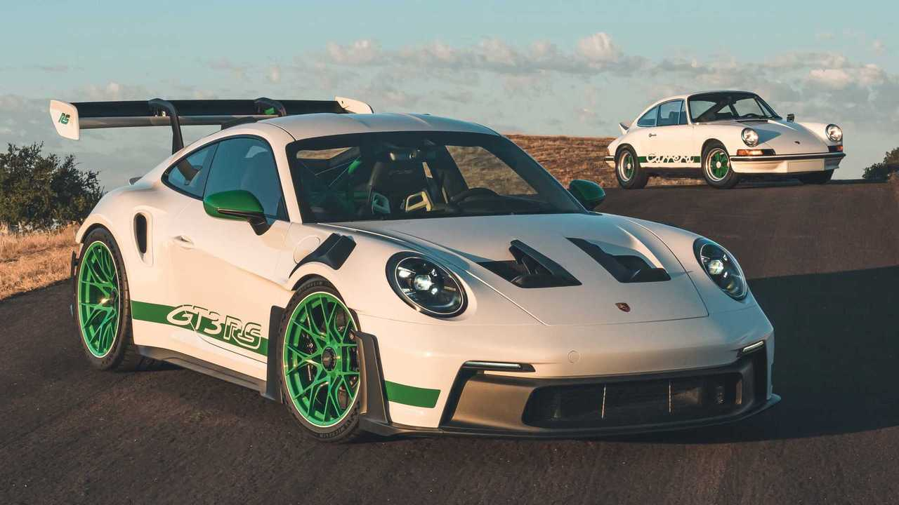

# Project Title: Car Brand Webpage

## HTML Code (index.html)
```html
<!DOCTYPE html>
<html>
<head>
    <link rel="stylesheet" href="FC-styles.css">
    <link rel="stylesheet" href="FC2-styles.css">
    <title>Responsive designs</title>

</head>

<body>
<header>
    <div class="flex-container">
        <h2 id="back-to-top">CarInfo.COM</h2>
    <a href="https://youtu.be/dQw4w9WgXcQ?si=fFyDrQUkPIdI-i70">About</a>
    <a href="mailto:moazzamk12319@gmail.com?subject=Feedback%20on%20your%20website&body=Hi%20there,%20I%20have%20some%20feedback%20for%20you.">Send Feedback</a>
   <a href="https://github.com/Moazzamkhan19/Web-development-F-E-.git">Github</a>
    </div>

</header>
<h1>Car Brands Information</h1>
      <div class="flex-container">
            <div class="content">
            <a href="#section1">Mercedes-Benz</a>
        </div>
         <div class="content1">
             <a href="#section2">BMW</a>
        </div>
        <div class="content2">
             <a href="#section3">Porche</a>
        </div>
      </div>

<div>
    <section id="section1">
        <h2 id="a">Mercedes-Benz</h2>
        <div>
            
        </div>
        <p><strong>Mercedes-Benz</strong>,commonly referred to simply as Mercedes, is a renowned German luxury automobile manufacturer.
        It is known for producing a wide range of high-quality vehicles, including luxury cars, buses, trucks, and vans.
        The company has a long and storied history, with a reputation for innovation, engineering excellence, and luxury.
         Mercedes-Benz was officially founded in 1926, though its origins trace back to the late 19th century.
        The brand was established by Karl Benz and Gottlieb Daimler, two pioneers in the automotive industry.
        Karl Benz created the first gasoline-powered automobile in 1886, the Benz Patent Motor Car, while Gottlieb Daimler and Wilhelm Maybach developed a motorized carriage around the same time.
        The brand is sold in over 170 countries, making it one of the most recognized and respected luxury car brands globally.
        </p>

    </section>

      <section id="section2">
        <h2 id="b">BMW</h2>
          <div>  </div>
        <p><em>BMW (Bayerische Motoren Werke AG)</em>is one of the world's leading premium automobile manufacturers, known for its high-performance vehicles
            and luxury offerings. The company has a rich history and is recognized globally for its engineering excellence, innovative technology, and iconic design.
            was founded on March 7, 1916.The company was initially established by Karl Rapp and Gustav Otto, with its origins rooted in the aviation industry.
            It originally started as an aircraft engine manufacturer, particularly during World War I.
             The BMW logo, featuring a circular design with blue and white quadrants, is inspired by the Bavarian flag.
            It also symbolizes a rotating aircraft propeller, reflecting the company's early roots in aviation.
            BMW is renowned for its luxury vehicles, which range from sedans and SUVs to sports cars and motorcycles.
        </p>

    </section>

      <section id="section3">
        <h2 id="c">Porche</h2>
          <div>  </div>
        <p> Porsche AG is a renowned German automotive manufacturer specializing in high-performance sports cars, SUVs, and sedans.
            Known for its engineering excellence and distinctive design, Porsche has a storied history and a reputation for producing some of the world's most iconic sports cars.
        was founded on January 25, 1931, by Ferdinand Porsche, an Austrian automotive engineer.Ferdinand Porsche, who is credited with designing the original Volkswagen Beetle.
            The company initially provided consulting services and was not directly involved in manufacturing cars.
        The first Porsche-branded car, the Porsche 356, was introduced in 1948 by Ferdinand's son, Ferdinand "Ferry" Porsche, after World War II.
            The 356 was designed and built by the company’s founder and became the foundation of Porsche's legacy in automotive performance.</p>
    </section>

    <section id="top">
       <a href="#back-to-top">Back-to-top</a>
    </section>
</div>
</body>
</html>
head{
    padding: 0;
    margin: 0;
}
body{
    background-color: lightgrey;
}
* {
    padding: 20px;
    margin: 10px;
    text-align: center;
    border-radius: 100px;
    box-sizing: border-box;
}
.flex-container
{
    display: flex;
    flex-direction: row; /*makes elements in row/column/reverse*/
    flex-wrap: nowrap;
    justify-content: center; /*aligns the content in center*/
    align-items: flex-end;/*aligns text on the container*/

}
h1
{
    background-color: grey;
    text-align: center;

}

.content:hover
{
    background-color: lightgreen;

}
.content1:hover
{
    background-color: skyblue;

}
.content2:hover
{
    background-color: lightpink;
}
/*------------------------------------------------------------------------------*/
.content
{
    background-color: darkseagreen;
}
.content1
{
    background-color:lightblue ;

}
.content2
{
    background-color: pink;
}
@media (max-width:768px )
{
    h1
    {
        background-color: darkseagreen;
    }
    #section1 img
    {
        width:120%;
        height: 120%;
        float: right;
    }
     #section2 img
    {
        width:120%;
        height: 120%;
        float: right;
    }
      #section3 img
    {
        width:120%;
        height: 120%;
        float: right;
    }

}
.header.h1
{
    background-color: lightsteelblue;
}
head{
    padding: 0;
    margin: 0;
}
header h2
{
    background-color: lightsteelblue;
}
header
{
margin-bottom: 0;
    padding: 0;
}
a:hover
{
    color:lightslategray;
}
header a{
    color:black;
    background-color:lavender;
    text-decoration: none;
}
.content a
{
   text-decoration: none;
    color:black;
}
.content1 a
{
   text-decoration: none;
    color:black;
}
.content2 a
{
     text-decoration: none;
    color:black;
}
#section1
{
    background-color:lavender;
    margin: 30px;
    overflow:hidden;
}
#section2
{
    background-color: lavender;
    margin: 30px;
}
#section3
{
    background-color: lavender;
    margin: 30px;
}
#top
{
 background-color: plum;
   margin-left: 200px;
    margin-right: 200px;
}
#top a
{
    text-decoration: none;
    color:rebeccapurple;
}
#section1 img
{
    float: right;
}
#section2 img
{
    float: right;
}
#section3 img
{
    float: right;
}
#a{
    background-color: #6c71c4;
}
#b{
    background-color: skyblue;
}
#c{
    background-color: yellowgreen;
}
